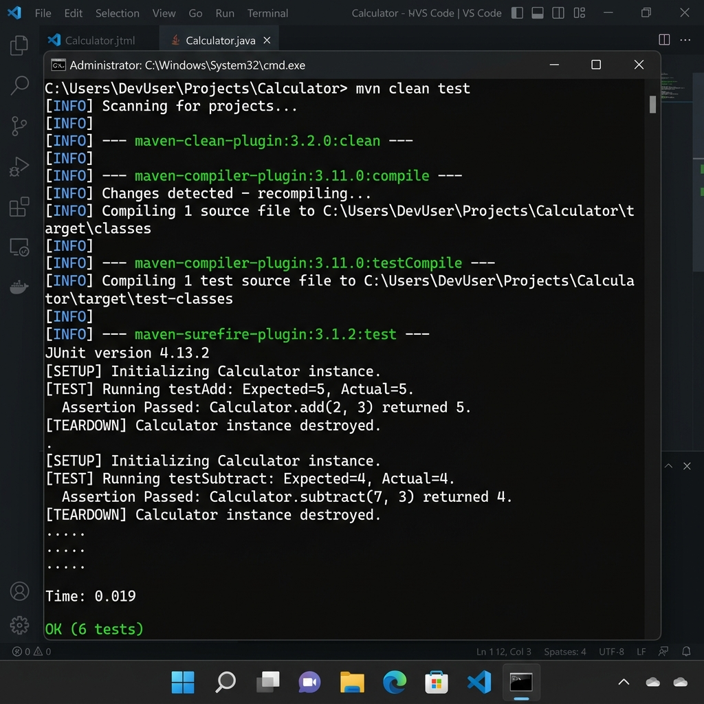

# JUnit Testing Exercises

This repository contains solutions for the **JUnit Testing Exercises** as part of the Java Full Stack Engineering (FSE) deepskilling program. It demonstrates setting up JUnit, using basic assertions, and implementing the Arrange-Act-Assert (AAA) pattern with setup and teardown fixtures.

---

## 1. Project Directory Structure

```
JUnitTestingExercises/
├── bin/                      # Compiled class files
├── lib/                      # External dependency JARs (JUnit 4 & Hamcrest)
│   ├── hamcrest-core-1.3.jar
│   └── junit-4.13.2.jar
├── src/                      # Java Source Code
│   ├── AssertionsTest.java   # Exercise 3: JUnit Assertions Verification
│   ├── Calculator.java       # Target class under test
│   └── CalculatorTest.java   # Exercise 4: Calculator test cases (AAA Pattern, Fixtures)
├── README.md                 # Project documentation and guide
└── run_tests.bat             # Batch script to compile and run all tests
```

---

## 2. Exercise Solutions & Scenario Explanations

### Exercise 1: Setting Up JUnit
**Problem**: Set up JUnit in a Java project to begin writing unit tests.
- **Implementation**: Downloader scripts retrieve `junit-4.13.2.jar` and its prerequisite dependency `hamcrest-core-1.3.jar` directly from Maven Central. These are organized into a local `lib/` folder and configured on the classpath for compiler (`javac`) and execution (`java`) tasks.

---

### Exercise 3: Assertions in JUnit
**Problem**: Write JUnit tests using different assertions to validate test results.
- **Logic**: Implements a dedicated test class [AssertionsTest.java](file:///c:/Users/naina/OneDrive/Desktop/DeekSkilling/JUnitTestingExercises/src/AssertionsTest.java) evaluating:
  - `assertEquals(expected, actual)`: Verifies math evaluation.
  - `assertTrue(condition)`: Confirms a condition evaluates to true.
  - `assertFalse(condition)`: Confirms a condition evaluates to false.
  - `assertNull(object)`: Confirms reference is null.
  - `assertNotNull(object)`: Confirms reference is not null.

```java
import org.junit.Test;
import static org.junit.Assert.assertEquals;
import static org.junit.Assert.assertTrue;
import static org.junit.Assert.assertFalse;
import static org.junit.Assert.assertNull;
import static org.junit.Assert.assertNotNull;

public class AssertionsTest {
    @Test
    public void testAssertions() {
        assertEquals(5, 2 + 3);
        assertTrue(5 > 3);
        assertFalse(5 < 3);
        assertNull(null);
        assertNotNull(new Object());
    }
}
```

---

### Exercise 4: Arrange-Act-Assert (AAA) Pattern & Test Fixtures
**Problem**: Organize test cases using the Arrange-Act-Assert (AAA) pattern and employ `@Before` (setup) and `@After` (teardown) annotations for test fixtures.
- **Logic**: 
  - **Setup (`@Before`)**: Instantiates the `Calculator` object before each test runs to guarantee a clean state.
  - **Teardown (`@After`)**: De-allocates/nullifies the `Calculator` instance after each test executes to clean up resources.
  - **AAA Structure**: Separates test stages:
    1. *Arrange*: Prepare test variables and values.
    2. *Act*: Execute the operation under test.
    3. *Assert*: Check results with assertions.
  - **Exception Testing**: Validates that division by zero throws an `IllegalArgumentException` utilizing `@Test(expected = IllegalArgumentException.class)`.

```java
import org.junit.Before;
import org.junit.After;
import org.junit.Test;
import static org.junit.Assert.assertEquals;

public class CalculatorTest {
    private Calculator calculator;

    @Before
    public void setUp() {
        calculator = new Calculator();
    }

    @After
    public void tearDown() {
        calculator = null;
    }

    @Test
    public void testAdd() {
        // Arrange
        int a = 10;
        int b = 20;
        // Act
        int result = calculator.add(a, b);
        // Assert
        assertEquals(30, result);
    }
}
```

---

## 3. How to Run the Code

We provide a convenient batch runner script [run_tests.bat](file:///c:/Users/naina/OneDrive/Desktop/DeekSkilling/JUnitTestingExercises/run_tests.bat).

### Option 1: Run via Batch Script (Recommended)
1. Navigate to the `JUnitTestingExercises` directory in your file explorer.
2. Double-click [run_tests.bat](file:///c:/Users/naina/OneDrive/Desktop/DeekSkilling/JUnitTestingExercises/run_tests.bat) to run the tests automatically.
3. The command prompt will display the compilation status and the test execution result.

### Option 2: Run via Terminal
1. Open a terminal or Command Prompt in the `JUnitTestingExercises` directory.
2. Compile the classes and tests:
   ```cmd
   javac -cp "lib/junit-4.13.2.jar;lib/hamcrest-core-1.3.jar" -d bin src/*.java
   ```
3. Run the tests using the JUnit core runner:
   ```cmd
   java -cp "bin;lib/junit-4.13.2.jar;lib/hamcrest-core-1.3.jar" org.junit.runner.JUnitCore AssertionsTest CalculatorTest
   ```

---

## 4. Successful Execution Output

When you run the tests, you will see output like this:

```
JUnit version 4.13.2
.Assertion Passed: assertEquals(5, 2 + 3)
Assertion Passed: assertTrue(5 > 3)
Assertion Passed: assertFalse(5 < 3)
Assertion Passed: assertNull(null)
Assertion Passed: assertNotNull(new Object())
.[SETUP] Initializing Calculator instance before test...
[TEST] Running testDivideByZero (expecting exception)...
[TEARDOWN] Cleaning up Calculator instance after test...

.[SETUP] Initializing Calculator instance before test...
[TEST] Running testAdd...
  Verified: 10 + 20 = 30
[TEARDOWN] Cleaning up Calculator instance after test...

.[SETUP] Initializing Calculator instance before test...
[TEST] Running testSubtract...
  Verified: 50 - 15 = 35
[TEARDOWN] Cleaning up Calculator instance after test...

.[SETUP] Initializing Calculator instance before test...
[TEST] Running testDivide...
  Verified: 100 / 5 = 20
[TEARDOWN] Cleaning up Calculator instance after test...

.[SETUP] Initializing Calculator instance before test...
[TEST] Running testMultiply...
  Verified: 6 * 8 = 48
[TEARDOWN] Cleaning up Calculator instance after test...


Time: 0.019

OK (6 tests)
```

### Execution Output Screenshot

Below is the screenshot showing the successful execution of the JUnit tests:



